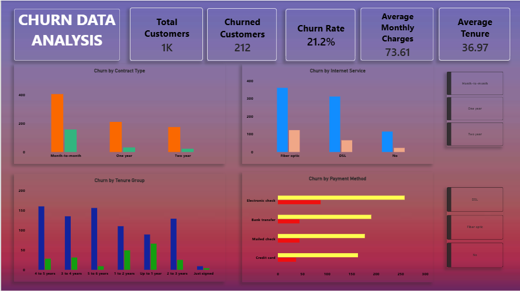

# Customer Churn Analysis Dashboard

## Project Overview

Analyzed customer data to identify churn patterns, customer retention trends, and factors associated with customer attrition. The analysis was performed using **Excel and Power BI**.

## Objective

* Analyze customer churn and retention patterns
* Identify customer segments with higher churn
* Compare churn across contract types and tenure groups
* Build an interactive dashboard for data-driven analysis

## Dataset

* **7,043 customer records**
* **21+ customer attributes**
* **1,869 churned customers**
* **26.5% overall churn rate**
* Analysis included **3 contract types** and **6+ tenure groups**

## Tools & Technologies

* **Microsoft Excel:** Data cleaning, formulas, PivotTables, and analysis
* **Power BI:** Data transformation, visualization, KPI cards, slicers, and interactive dashboard

## Analysis Performed

* Cleaned and prepared customer data using Excel
* Analyzed churn patterns using PivotTables
* Examined churn by contract type and tenure group
* Created KPIs to monitor customer churn
* Developed interactive Power BI visualizations and slicers

## Key Metrics

| Metric                  | Value |
| ----------------------- | ----: |
| Total Customers         | 7,043 |
| Churned Customers       | 1,869 |
| Churn Rate              | 26.5% |
| Contract Types Analyzed |     3 |
| Tenure Groups Analyzed  |    6+ |

## Dashboard

The Power BI dashboard provides an interactive view of customer churn using KPI cards, charts, and slicers to explore customer segments and churn patterns.

## Files

* `Customer_Churn_Excel_Project.xlsx` — Excel-based data cleaning and analysis
* `churn data analysis.pbix` — Power BI interactive dashboard

## Skills Demonstrated

**Excel | Data Cleaning | Data Analysis | PivotTables | Power BI | Data Visualization | Dashboard Development | KPI Analysis**
## Dashboard Preview

